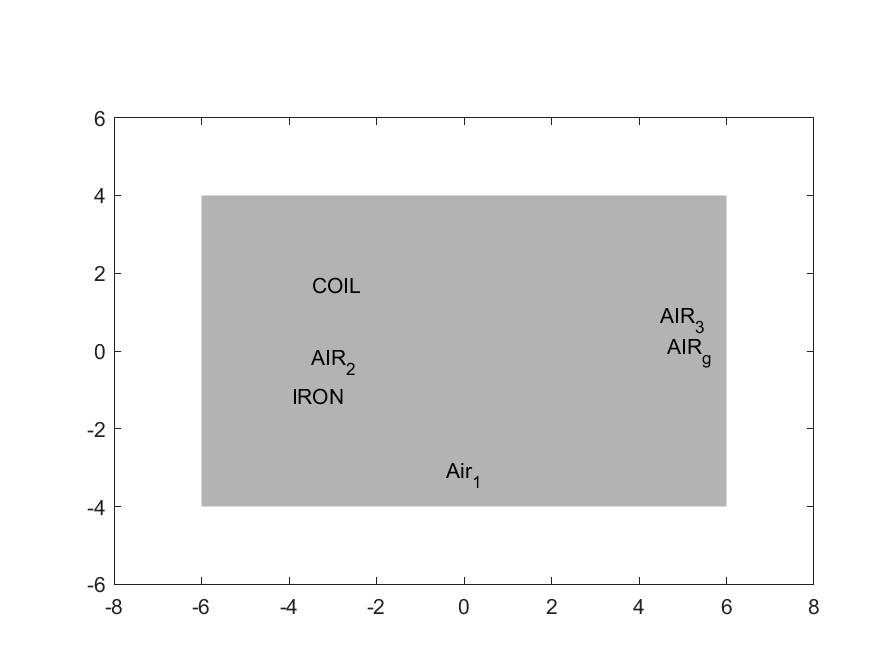
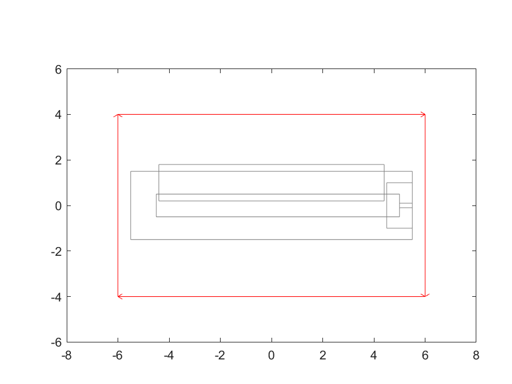
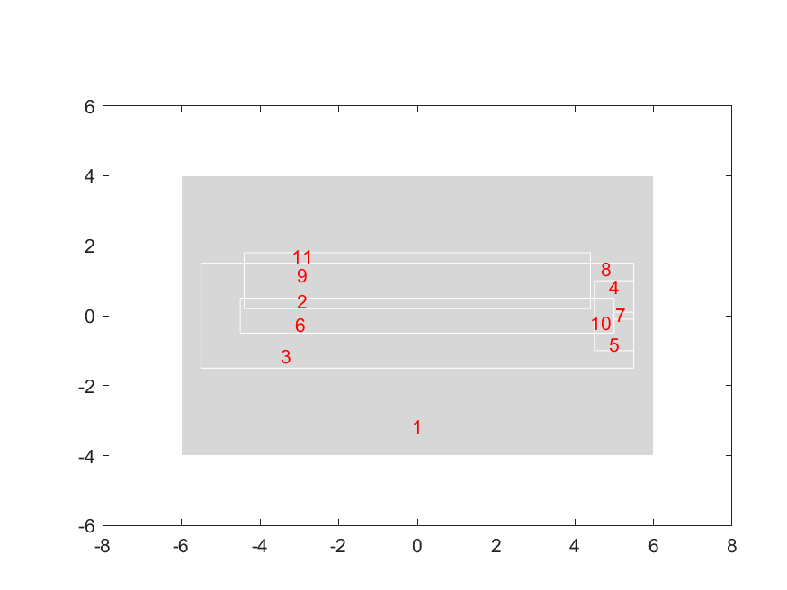
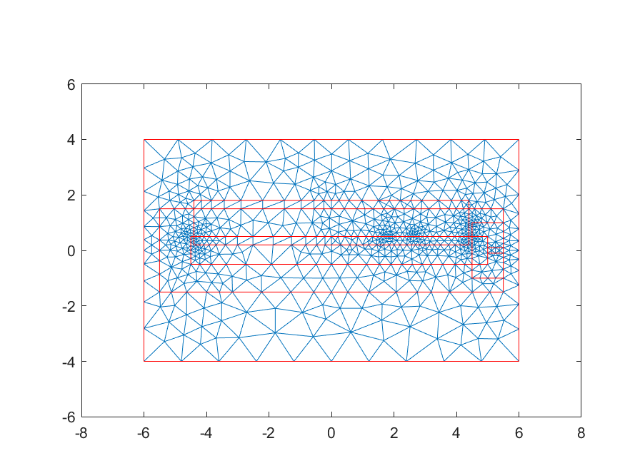
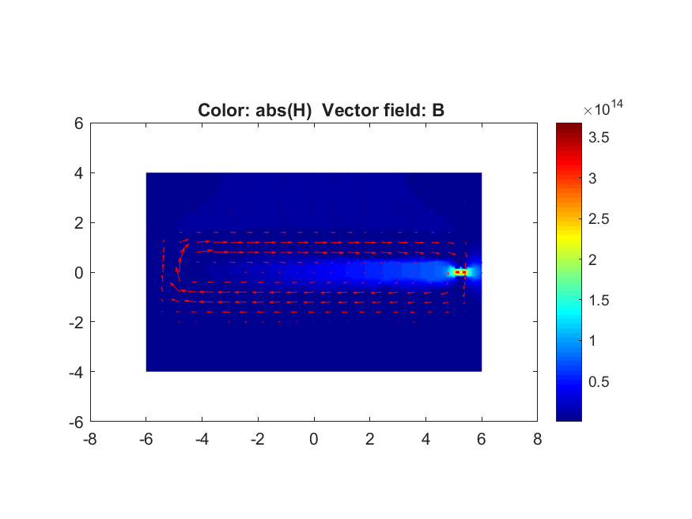
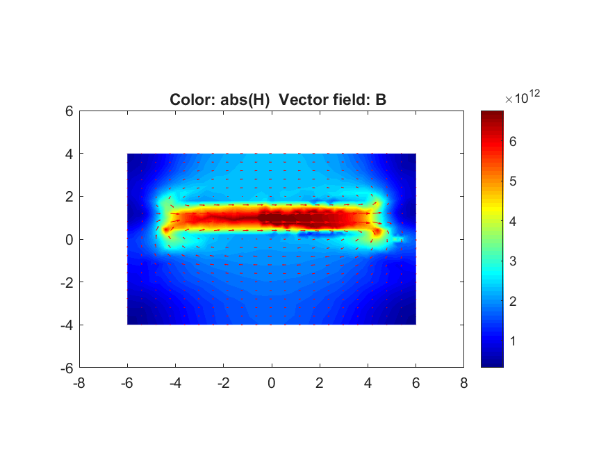

# 📝 Engineering Mathematics — Computer Assignment 2: Numerical Partial Differential Equations (PDEs)

> Advanced numerical modeling of 2D magnetostatic systems using the Finite Element Method in MATLAB PDE Modeler, theoretical comparative evaluation of PDE discretization paradigms (FDM, FVM, FEM), 1D parabolic heat diffusion via `pdepe`, and 2D steady-state/transient thermal diffusion using explicit Finite Difference schemes.

[](#)
[](#)
[](../LICENSE)
[](#)
[](#)

---

## 👨‍🎓 Student Information

| Field | Value |
|---|---|
| **Student Name** | Amirali Dehghani |
| **Student ID** | `810102443` |
| **Course** | Engineering Mathematics (ECE) |
| **Semester** | Fall 2024 (Fall 1403) |
| **Instructor** | Dr. Mehdi Tale Masouleh |
| **Submission Date** | January 2025 (10/11/1403) |

---

## 📋 Assignment Objectives

1. 🎯 **2D Magnetostatic Field Modeling (FEM via PDE Modeler):** Formulate and simulate an electromagnetic actuator composed of a ferromagnetic core, excitation coil windings, and air gaps by solving the vector Poisson equation $-\nabla \cdot (c \nabla u) = f$. Analyze magnetic flux confinement ($\mathbf{B} = \mu \mathbf{H}$), reluctance paths, and the consequences of core degradation.
2. 🎯 **Comparative Methodology Analysis (FDM vs. FVM vs. FEM):** Conduct a rigorous theoretical comparison between the three pillar numerical methods for solving partial differential equations, examining spatial discretization, flux conservation, boundary flexibility, and computational complexity.
3. 🎯 **1D Transient Heat Diffusion via `pdepe`:** Solve a parabolic initial-boundary value problem (IBVP) with nonlinear initial temperature distribution and fixed Dirichlet boundaries using MATLAB's built-in PDE solver, analyzing temporal asymptotic relaxation toward equilibrium.
4. 🎯 **2D Steady-State Heat Conduction via FDM:** Implement a 5-point discrete Laplacian stencil with Jacobi iterative relaxation on a $100 \times 100$ spatial mesh to solve the elliptic Laplace equation $\nabla^2 T = 0$ under non-uniform boundary temperatures.
5. 🎯 **2D Transient Heat Diffusion via Explicit FTCS:** Discretize the 2D parabolic heat equation $\frac{\partial T}{\partial t} = \alpha \nabla^2 T$ using Forward-Time Central-Space (FTCS) explicit finite differences, enforcing the CFL stability criterion and recording temporal thermal evolution snapshots.

---

## 📊 Physical & Simulation Specifications

### Part 1: Magnetostatic System Parameters

| Region / Subdomain | Geometry Bounds $(X \times Y)$ | Relative Permeability ($\mu_r$) | Current Density ($J_z$) | Physical Role |
|---|---|---|---|---|
| `Air_1` | $[-6.0, 6.0] \times [-4.0, 4.0]$ | $1.0$ | $0\text{ A/m}^2$ | Far-field ambient air domain; outer boundary set to $A_z = 0$. |
| `IRON` | $[-5.5, 5.5] \times [-1.5, 1.5]$ | $2000.0$ | $0\text{ A/m}^2$ | High-permeability ferromagnetic core channeling magnetic flux. |
| `COIL` | $[-4.4, 4.4] \times [0.2, 1.8]$ | $1.0$ | $\pm 3 \times 10^7\text{ A/m}^2$ | Copper excitation winding driving the magnetostatic field. |
| `AIR_g` | $[5.0, 5.5] \times [-0.1, 0.1]$ | $1.0$ | $0\text{ A/m}^2$ | Working air gap where high field energy is delivered. |
| `AIR_2`, `AIR_3` | Internal window cutouts | $1.0$ | $0\text{ A/m}^2$ | Non-magnetic clearances surrounding the coil and core legs. |

### Part 2: Heat Diffusion & FDM Mesh Parameters

| Parameter | Symbol | Value | Physical Significance |
|---|---|---|---|
| Plate Dimensions | $W \times H$ | $1.0\text{ m} \times 1.0\text{ m}$ | Square 2D isotropic conductive domain. |
| Grid Dimensions | $N_x \times N_y$ | $100 \times 100$ nodes | Spatial resolution yielding $\Delta x = \Delta y = \frac{1}{99}\text{ m} \approx 0.0101\text{ m}$. |
| Thermal Diffusivity | $\alpha$ | $0.1\text{ m}^2/\text{s}$ | Material thermal propagation rate. |
| Time Step | $\Delta t$ | $0.0001\text{ s}$ | Explicit integration step satisfying CFL stability criterion ($r \approx 0.098 \le 0.25$). |
| Total Time | $t_{\text{total}}$ | $1.0\text{ s}$ | $10,000$ discrete time steps to observe thermal relaxation. |
| Boundary Temps | $T_{\text{top}}, T_{\text{bot}}, T_{\text{left}}, T_{\text{right}}$ | $75^\circ\text{C}, 130^\circ\text{C}, 110^\circ\text{C}, 45^\circ\text{C}$ | Fixed non-uniform Dirichlet boundary constraints. |
| Initial Temperature | $T_{\text{init}}$ | $25^\circ\text{C}$ | Uniform initial plate temperature at $t = 0$. |
| Convergence Tolerance | $\epsilon_{\text{tol}}$ | $5 \times 10^{-4}$ | Steady-state maximum pointwise temperature change threshold. |

---

## 🧪 Methods & Detailed Explanations

### Part 1: Magnetostatic Field Simulation in MATLAB PDE Modeler

#### Governing Maxwell Formulation
Magnetostatic fields are governed by Ampere's Law and Gauss's Law for magnetism:
$$\nabla \times \mathbf{H} = \mathbf{J}, \quad \nabla \cdot \mathbf{B} = 0$$
with the constitutive relation $\mathbf{B} = \mu \mathbf{H} = \mu_0 \mu_r \mathbf{H}$.

Since $\nabla \cdot \mathbf{B} = 0$, the magnetic flux density can be expressed as the curl of a magnetic vector potential $\mathbf{A}$:
$$\mathbf{B} = \nabla \times \mathbf{A}$$
In a 2D planar system where current flows exclusively along the z-axis ($\mathbf{J} = J_z \hat{\mathbf{z}}$), the vector potential simplifies to $\mathbf{A} = A_z(x, y) \hat{\mathbf{z}}$. Adopting the Coulomb gauge ($\nabla \cdot \mathbf{A} = 0$), Maxwell's equations reduce to an elliptic scalar Poisson PDE:
$$-\nabla \cdot \left(\frac{1}{\mu} \nabla A_z\right) = J_z$$
where $\mu(x, y) = \mu_0 \mu_r(x, y)$ varies across subdomains, and the magnetic flux density components are:
$$B_x = \frac{\partial A_z}{\partial y}, \quad B_y = -\frac{\partial A_z}{\partial x}$$
Lines of constant $A_z$ correspond directly to magnetic flux streamlines.

#### Boundary Conditions & Subdomain Setup
- **Far-Field Boundary:** A homogeneous Dirichlet boundary condition $A_z = 0$ is applied to the outermost boundary of `Air_1`. This forces magnetic flux lines to remain tangential to the outer boundary, preventing unphysical flux escape to infinity and isolating the computational domain.
- **Subdomain Permeabilities:** The relative permeability $\mu_r$ is configured as $2000$ within `IRON` and $1$ in all air and coil regions.
- **Current Source Excitation:** The excitation coil carries opposing current densities in its cross-sections to model forward and return current loops.

#### Physical Questions & Engineering Findings
1. **Role of High-Permeability Iron Core:** Magnetic reluctance is defined as $\mathcal{R} = \frac{l}{\mu A}$. Because the iron core possesses $\mu_r = 2000$, its reluctance is three orders of magnitude lower than the surrounding air. Consequently, magnetic flux lines preferentially concentrate inside the iron core, yielding high flux density $\mathbf{B}$ and minimal stray leakage.
2. **Contrast Between $\mathbf{B}$ and $\mathbf{H}$:** According to $\mathbf{B} = \mu \mathbf{H}$, continuity of normal flux across material interfaces forces $\mathbf{B}$ to remain continuous, while $\mathbf{H} = \frac{\mathbf{B}}{\mu}$ differs drastically between media. Inside the iron core, because $\mu$ is exceptionally large, the magnetic field intensity $\mathbf{H}$ is small (represented by dark blue in color maps). Conversely, inside the air gap and coil windings where $\mu = \mu_0$, $\mathbf{H}$ reaches high magnitudes (represented by vibrant red/yellow).
3. **Effect of Decreasing Core Permeability:** When the relative permeability $\mu_r$ drops (or if the iron core is removed), the magnetic reluctance of the core skyrockets to match the air. The low-reluctance magnetic circuit collapses: flux lines spill out of the core into the ambient air, the usable flux density in the working gap drops precipitously, and the spatial field intensity flattens across the entire domain.

---

### Part 2: Numerical Methods for Partial Differential Equations

#### 2.1 Comparative Analysis: FDM vs. FVM vs. FEM

| Characteristic | Finite Difference Method (FDM) | Finite Volume Method (FVM) | Finite Element Method (FEM) |
|---|---|---|---|
| **Fundamental Concept** | Replaces derivatives with algebraic difference approximations via Taylor series expansions. | Integrates conservation laws over small control volumes and evaluates surface fluxes. | Minimizes weighted residual/variational weak form over discrete polynomial sub-elements. |
| **Grid / Mesh Flexibility** | Highly restricted to structured rectangular Cartesian grids; struggles with curves. | Adaptable to both structured and unstructured polygonal/polyhedral meshes. | Exceptional versatility on complex, curved, and multi-scale unstructured meshes. |
| **Conservation Properties** | Conservation of flux is not guaranteed inherently unless special conservative stencils are used. | **Strict local and global flux conservation** across adjacent cell boundaries by construction. | Conserves quantities globally in a weak variational sense; not strictly locally conservative. |
| **Primary Engineering Application** | Simple rectangular domains, financial option pricing, basic thermal/wave benchmarks. | **Computational Fluid Dynamics (CFD)**, mass/energy transport, aerodynamics, porous media. | **Structural mechanics**, stress/strain analysis, electromagnetics, multi-physics simulations. |
| **Computational Complexity** | Very fast execution, low memory overhead, straightforward code implementation. | Moderate complexity; requires accurate boundary flux reconstruction schemes. | High algorithmic complexity; requires element stiffness matrix assembly and large sparse solvers. |

#### 2.2 1D Parabolic Heat Equation via MATLAB `pdepe`
The one-dimensional heat equation describes transient thermal diffusion along a homogeneous rod:
$$\frac{\partial u}{\partial t} = \frac{\partial^2 u}{\partial x^2}, \quad x \in [0, 1], \quad t \in [0, 1]$$
- **Initial Condition:** $u(x, 0) = \frac{2x}{1 + x^2}$, representing an asymmetric initial temperature distribution peaking at $x = 1$.
- **Boundary Conditions:** Fixed Dirichlet conditions:
  $$u(0, t) = 0, \quad u(1, t) = 1, \quad \forall t \ge 0$$
- **Asymptotic Equilibrium:** As $t \to \infty$, temporal variation vanishes ($\frac{\partial u}{\partial t} \to 0$), reducing the equation to the 1D Laplace equation $\frac{d^2 u}{dx^2} = 0$. Given $u(0) = 0$ and $u(1) = 1$, the temperature relaxes monotonically toward the linear steady-state profile $u(x) = x$. MATLAB's `pdepe` captures this transition smoothly via variable-step ODE time-stepping.

#### 2.3 2D Steady-State Heat Equation (Laplace) via FDM
In steady state, the temperature distribution inside an isotropic conductive plate reaches thermal equilibrium governed by Laplace's equation:
$$\nabla^2 T = \frac{\partial^2 T}{\partial x^2} + \frac{\partial^2 T}{\partial y^2} = 0, \quad (x, y) \in [0, 1] \times [0, 1]$$
- **Finite Difference Discretization:** Applying second-order central difference approximations with uniform node spacing $\Delta x = \Delta y$:
  $$\frac{T_{i+1, j} - 2T_{i, j} + T_{i-1, j}}{\Delta x^2} + \frac{T_{i, j+1} - 2T_{i, j} + T_{i, j-1}}{\Delta y^2} = 0$$
- **Discrete 5-Point Laplacian Stencil:** Rearranging for the central node $T_{i, j}$:
  $$T_{i, j}^{(k+1)} = \frac{1}{4} \left( T_{i+1, j}^{(k)} + T_{i-1, j}^{(k)} + T_{i, j+1}^{(k)} + T_{i, j-1}^{(k)} \right)$$
  Each interior node's temperature is iteratively updated to the arithmetic mean of its four nearest orthogonal neighbors (Jacobi relaxation).
- **Boundary Constraints:** Enforced at every iteration:
  $$T(\cdot, 1) = 75^\circ\text{C}, \quad T(\cdot, 0) = 130^\circ\text{C}, \quad T(0, \cdot) = 110^\circ\text{C}, \quad T(1, \cdot) = 45^\circ\text{C}$$
- **Convergence:** The algorithm halts when the maximum pointwise variation satisfies $\max_{i, j} |T_{i, j}^{(k+1)} - T_{i, j}^{(k)}| < 5 \times 10^{-4}$, producing a smooth thermal equilibrium contour.

#### 2.4 2D Transient Heat Equation via Explicit FTCS
When thermal diffusion varies with time, the governing equation is the 2D parabolic diffusion equation:
$$\frac{\partial T}{\partial t} = \alpha \left( \frac{\partial^2 T}{\partial x^2} + \frac{\partial^2 T}{\partial y^2} \right)$$
- **Forward-Time Central-Space (FTCS) Formulation:** Discretizing time with a forward difference and space with central differences:
  $$T_{i, j}^{k+1} = T_{i, j}^k + \alpha \Delta t \left( \frac{T_{i+1, j}^k - 2T_{i, j}^k + T_{i-1, j}^k}{\Delta x^2} + \frac{T_{i, j+1}^k - 2T_{i, j}^k + T_{i, j-1}^k}{\Delta y^2} \right)$$
- **Numerical Stability (Von Neumann / CFL Condition):** For 2D explicit parabolic systems with $\Delta x = \Delta y$, numerical stability requires:
  $$r = \frac{\alpha \Delta t}{\Delta x^2} \le \frac{1}{4} = 0.25$$
  With parameters $\alpha = 0.1\text{ m}^2/\text{s}$, $\Delta x = \frac{1}{99}\text{ m}$, and $\Delta t = 10^{-4}\text{ s}$:
  $$r = \frac{0.1 \times 10^{-4}}{(0.010101)^2} \approx 0.0980 \ll 0.25$$
  This confirms that the time-stepping scheme is unconditionally stable and free of spurious spatial oscillations.
- **Snapshot Evolution:** Evaluated at four key time instances ($t = 0\text{ s}, 0.25\text{ s}, 0.5\text{ s}, 1.0\text{ s}$) to observe how heat diffuses inward from the hot boundaries ($130^\circ\text{C}$ and $110^\circ\text{C}$) into the cold $25^\circ\text{C}$ core, approaching the steady-state solution of Part 2.3.

---

## 📈 Results & Visualizations

### Visualizations & Simulation Artifacts

| Simulation Step | Visual Output | Description |
|---|---|---|
| **Geometry Setup** |  | Construction of electromagnet subdomains: outer air boundary, iron core, coil, and working air gap. |
| **Boundary Conditions** |  | Application of magnetic insulation Dirichlet condition ($A_z = 0$) on outer boundaries. |
| **Subdomain Properties** |  | Assignment of material parameters ($\mu_r = 2000$ for iron, $\mu_r = 1$ for air/coil) and current densities. |
| **Mesh Generation** |  | Unstructured 2D triangular finite element mesh generated across all subdomains. |
| **Field & Potential Plot** |  | 2D color contour of magnetic vector potential $A_z$ with magnetic flux density vectors. |
| **Reluctance Analysis** |  | Flux leakage and field degradation observed when core relative permeability is reduced. |
| **Leakage Field Streamlines** |  | High-resolution streamline distribution displaying magnetic field line paths. |

### Key Findings & Engineering Insights

- ✅ **Flux Guiding & Saturation Pathways:** The iron core acts as a high-permeance magnetic conduit. With $\mu_r = 2000$, virtually all magnetic flux generated by the coil is guided directly across the working air gap, demonstrating why high-permeability ferromagnetic materials are indispensable for electromagnetic motors, transformers, and actuators.
- ✅ **Field Inversion Principle ($\mathbf{B}$ vs. $\mathbf{H}$):** While flux density $\mathbf{B}$ is concentrated inside the core, magnetic field intensity $\mathbf{H}$ is suppressed inside the core and peaks in the air gap and coil. This aligns with Ampere's circuital law $\oint \mathbf{H} \cdot d\mathbf{l} = N I$, where the highest magnetomotive force drop occurs across the high-reluctance air gap.
- ✅ **FDM Relaxation & Convergence:** The Jacobi iterative scheme on the $100 \times 100$ mesh converged smoothly within the $10,000$ iteration limit to the tolerance $\epsilon = 5 \times 10^{-4}$. The resulting temperature surface forms a smooth saddle connecting the disparate boundaries ($130^\circ\text{C}$ at bottom, $110^\circ\text{C}$ at left, $75^\circ\text{C}$ at top, and $45^\circ\text{C}$ at right).
- ✅ **Transient Thermal Diffusion Consistency:** The explicit FTCS solver at $t = 1.0\text{ s}$ closely matches the steady-state thermal distribution from the elliptic Laplace solution, proving mathematical consistency between transient diffusion dynamics as $t \to \infty$ and steady-state equilibrium.
- ✅ **CFL Stability Adherence:** Strict adherence to the diffusion CFL stability limit ($r \approx 0.098 < 0.25$) ensured smooth numerical dissipation without any unphysical oscillations or numerical blow-up.

---

## 🚀 How to Run

### Prerequisites
- MATLAB R2020a or later
- Partial Differential Equation Toolbox (required for `pdetool` / PDE Modeler and `pdepe`)

### Execution
Open MATLAB, navigate to the `CA2` directory, and run the respective models:

```matlab
% Navigate to CA2
cd('CA2');

% 1. Launch PDE Modeler Magnetostatic Simulation (Part 1)
run('Part1.m');

% 2. Run 1D Heat Equation with pdepe (Part 2.2)
run('Part2_2.m');

% 3. Run 2D Steady-State Laplace Heat Equation via FDM (Part 2.3)
run('Part2_3.m');

% 4. Run 2D Transient Heat Diffusion via Explicit FDM (Part 2.4)
run('Part2_4.m');
```

---

## 📂 Directory Structure

```
CA2/
├── Part1.m                  # 2D Magnetostatic simulation model for MATLAB PDE Modeler
├── Part2_2.m                # 1D Parabolic Heat Equation solution using pdepe
├── Part2_3.m                # 2D Steady-State Laplace Heat Equation using Jacobi iterative FDM
├── Part2_4.m                # 2D Transient Heat Diffusion using explicit FTCS finite differences
├── 1-2.png                  # Simulation geometry modeling screenshot
├── 1-3.png                  # Boundary condition configuration screenshot
├── 1-4.png                  # Subdomain PDE coefficient setup screenshot
├── 1-5-1.png                # Finite element triangular mesh screenshot
├── 1-5-2.png                # Magnetic vector potential and flux density contour plot
├── 1-Q3-1.png               # Flux distribution analysis under altered core permeability
├── 1-Q3-2.png               # Magnetic field streamline leakage visualization
├── Engmath-CA2-810102443.pdf # Student technical report with derivations & discussions
├── Engmath-CA2-810102443.docx# Editable technical report document
└── README.md                # This documentation file
```

---

## 🛠️ Technologies & Mathematical Principles

| Category | Tools & Concepts |
|---|---|
| **Programming Language** | MATLAB |
| **Toolboxes Used** | Partial Differential Equation Toolbox (`pdetool`, `pdepe`) |
| **Mathematical Domains** | Partial Differential Equations (Elliptic, Parabolic), Vector Calculus, Maxwell's Equations, Fourier Conduction |
| **Numerical Schemes** | Finite Element Method (FEM), Finite Difference Method (FDM), Forward-Time Central-Space (FTCS), Jacobi Iteration |
| **Visualization Tools** | `pcolor`, `surf`, `shading interp`, MATLAB PDE Modeler GUI |

---

## 📜 License

This project is licensed under the **MIT License** — see the [LICENSE](../LICENSE) file for details.
